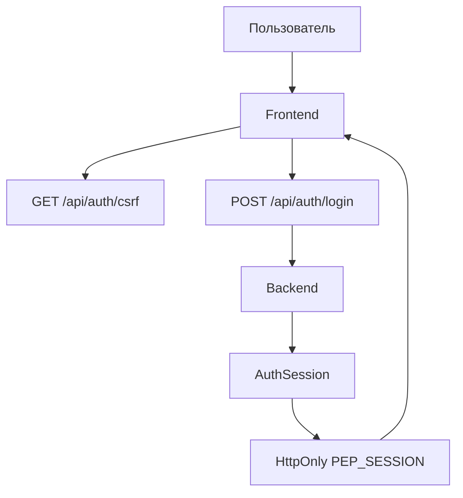
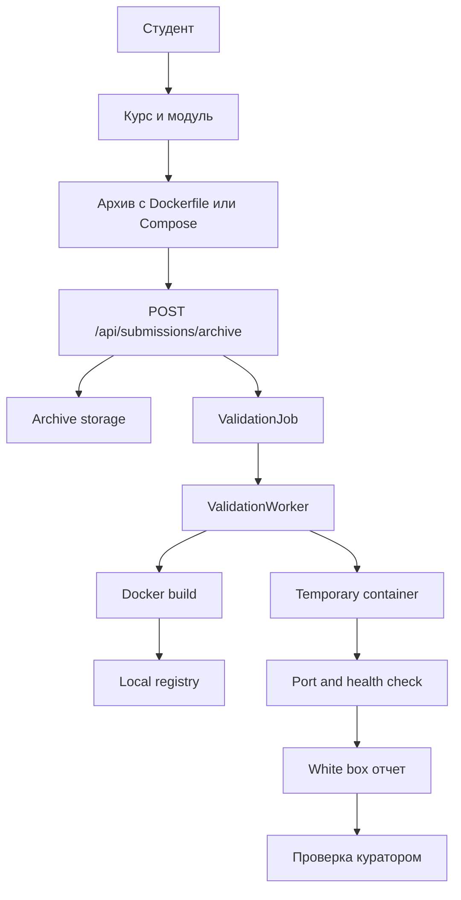
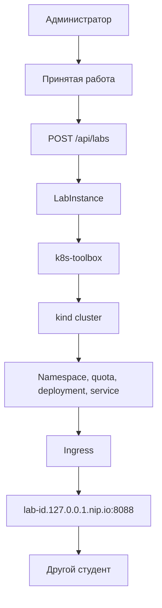
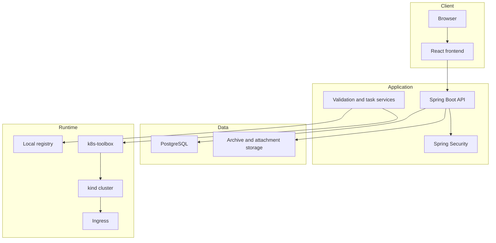

# PEP - образовательная платформа по информационной безопасности

PEP - практическая платформа для обучения web-безопасности, Docker, white box и black box тестированию.
Платформа рассчитана на дипломную демонстрацию и локальный production-like контур: backend, frontend,
PostgreSQL, локальный registry, `kind`-кластер, toolbox-контейнер и системные официальные
пентест-стенды.

## Возможности

- Русскоязычные учебные материалы с Markdown, примерами уязвимого кода и практическими методиками.
- Вводный курс по Docker.
- Академия web-безопасности: SQL-инъекции, XSS, SSTI, SSRF, CSRF, CORS, XXE, бизнес-логика, BAC, IDOR.
- Загрузка студентом архива стенда с `Dockerfile` или `docker-compose.yml`.
- Fallback-режим отправки готового Docker image reference.
- Техническая проверка стенда: сборка, image metadata scan, dependency metadata scan, запуск контейнера и health check.
- White box и black box отчеты с вложениями.
- Проверка отчетов куратором.
- Запуск лабораторий в `kind` с локальными ingress-доменами.
- Официальные системные стенды: админ публикует задачу, PEP подготавливает image и запускает стенд на 4 часа.
- Админ-панель: курсы, модули, Markdown-редактор страниц, пользователи, аудит, online-статистика, системные задачи.

## Технологический стек

- Backend: Java 17, Spring Boot, Spring Security, Spring Data JPA, Flyway.
- Frontend: React, TypeScript, Vite.
- Database: PostgreSQL, H2 для тестов.
- Runtime: Docker, Docker Compose, local registry, `kind`, `kubectl`, nginx ingress.
- Auth: server-side sessions через `HttpOnly` cookie, CSRF token для unsafe methods.

## Быстрый запуск

```powershell
docker compose up --build
```

После запуска:

- Frontend HTTPS: `https://localhost:5443`
- Frontend HTTP fallback: `http://localhost:5173`
- Backend API: `http://localhost:8080`
- Backend health: `http://localhost:8080/actuator/health`
- Local registry: `localhost:5001`

> **Важно для пользователей с системным HTTP/HTTPS-прокси (VPN, Clash, Shadowsocks, V2Ray и т. п.).**
> URL запущенных стендов имеют вид `http://task-<slug>-<id>.127.0.0.1.nip.io:8088`. Если в системе включён прокси,
> Chrome и любые `HttpClient`-приложения будут пытаться достучаться до стенда через него и получат 502 (прокси
> не видит локальный kind-кластер). Добавь `*.nip.io;localhost;127.0.0.1;<local>` в bypass:
> Настройки Windows → «Прокси» → раздел «Не использовать прокси для адресов, начинающихся со следующих записей»,
> либо PowerShell:
>
> ```powershell
> Set-ItemProperty -Path 'HKCU:\Software\Microsoft\Windows\CurrentVersion\Internet Settings' \
>   -Name ProxyOverride -Value '*.nip.io;localhost;127.0.0.1;<local>'
> ```
>
> После этого перезапусти Chrome (или просто открой ссылку стенда заново). `curl.exe` к bypass нечувствителен
> и работает напрямую — этим удобно проверять доступность стенда: `curl http://task-...127.0.0.1.nip.io:8088/`.

Demo-аккаунты:

| Роль | Email | Пароль |
| --- | --- | --- |
| Администратор | `admin@local.host` | `admin` |
| Куратор | `teacher@local.host` | `teacher` |
| Студент | `student@local.host` | `student` |
| Demo admin | `admin@pep.local` | `admin` |
| Demo curator | `curator@pep.local` | `curator` |
| Demo student 1 | `student1@pep.local` | `student` |
| Demo student 2 | `student2@pep.local` | `student` |

## Основные флоу

### Авторизация



1. Frontend получает CSRF token.
2. Пользователь отправляет email и пароль.
3. Backend проверяет учетную запись, rate limit и пароль.
4. Backend создает server-side session и ставит `PEP_SESSION`.
5. Все последующие API-запросы идут с cookie и CSRF header для небезопасных методов.

### Обучение и сдача студентского стенда



Студент загружает архив проекта. Backend сохраняет архив, создает submission и validation job.
Worker распаковывает проект, проверяет опасные настройки, собирает image, публикует его в registry,
временно запускает контейнер и проверяет доступность.

### Запуск лаборатории для black box



Администратор создает lab instance для принятой работы. UI показывает команды toolbox и ingress URL.
Black box assignment распределяет чужие стенды студентам.

## Архитектура компонентов



### Backend

- `CorePlatformController` - основной REST API.
- `CorePlatformService` - курсы, уроки, submissions, отчеты, lab runtime, пользователи.
- `ValidationWorkerService` - technical validation и сборка archive submissions.
- `PentestTaskService` - каталог системных стендов, сборка задач, запуск экземпляров.
- `AuthSessionService` - login/logout/session cookie/rate limit.
- `AuditService` - события безопасности и администрирования.

### Frontend

- `TopNavigation` - основные разделы: рабочая область, курсы, стенды, личный кабинет.
- `CoursesPage` - каталог курсов и модулей.
- `StudentDashboard` - обучение, практика, отчеты.
- `CuratorDashboard` - technical validation и проверка отчетов.
- `AdminDashboard` - курсы, пользователи, системные задачи, labs, аудит, аналитика.
- `PentestTasksPage` - каталог официальных стендов и активные запуски студента.

### Database

Ключевые таблицы:

- `app_user`, `auth_session`, `auth_login_throttle`
- `course`, `module`, `lesson`, `lesson_progress`
- `submission`, `validation_job`
- `report`, `review`, `report_attachment`
- `lab_instance`, `black_box_assignment`
- `pentest_task`, `pentest_task_build`, `pentest_task_instance`
- `audit_event`

## User stories

### Студент

- Как студент, я хочу открыть каталог курсов, выбрать модуль и изучить материал.
- Как студент, я хочу загрузить архив со стендом, чтобы платформа сама собрала и проверила приложение.
- Как студент, я хочу отправить white box отчет с доказательствами уязвимости.
- Как студент, я хочу получить чужой стенд для black box проверки.
- Как студент, я хочу открыть системный стенд на 4 часа по поддомену.

### Куратор

- Как куратор, я хочу видеть очередь отчетов и проверять их.
- Как куратор, я хочу видеть результаты technical validation и контекст submission.
- Как куратор, я хочу экспортировать оценки по модулю.

### Администратор

- Как администратор, я хочу создавать курсы, модули и страницы в Markdown.
- Как администратор, я хочу создавать и отключать пользователей.
- Как администратор, я хочу видеть online-статистику и аудит.
- Как администратор, я хочу запускать lab runtime и распределять black box цели.

## Lab runtime через kind

Запуск registry и toolbox:

```powershell
docker compose up -d registry k8s-toolbox
```

Создание кластера:

```powershell
docker compose exec k8s-toolbox pep-kind-create
```

Установка ingress:

```powershell
docker compose exec k8s-toolbox pep-ingress-install
```

Запуск student lab:

```powershell
docker compose exec k8s-toolbox pep-lab-deploy <submissionId> localhost:5001/image:latest 8080
```

Запуск task lab:

```powershell
docker compose exec k8s-toolbox pep-task-deploy <namespace> localhost:5001/pentest-task-demo:latest 8080
```

## Production defaults

- `PEP_DEMO_DATA_ENABLED=false`
- `PEP_AUTH_BASIC_ENABLED=false`
- `PEP_AUTH_CSRF_ENABLED=true`
- `PEP_VALIDATION_WORKER_ENABLED=false`
- `PEP_AUTH_COOKIE_SECURE=true`
- Docker socket доступен только из выделенного worker/toolbox runtime

## Проверка

Backend:

```powershell
cd backend
mvn test
```

Frontend:

```powershell
cd frontend
npm run build
```

Полный demo-контур:

```powershell
docker compose up --build
```

## Примечание

Cursor plan-файлы не являются runtime-документацией. Актуальная инструкция по запуску и архитектуре
поддерживается в этом `README.md` и в `docs/`.
