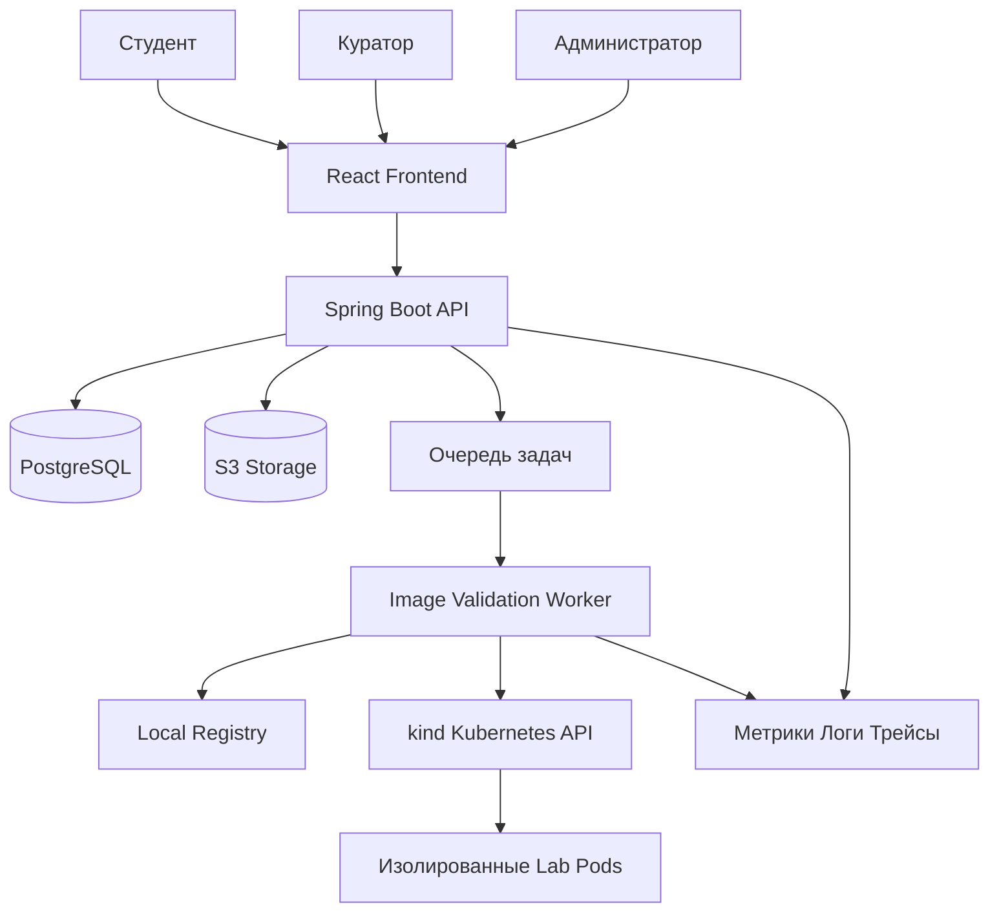
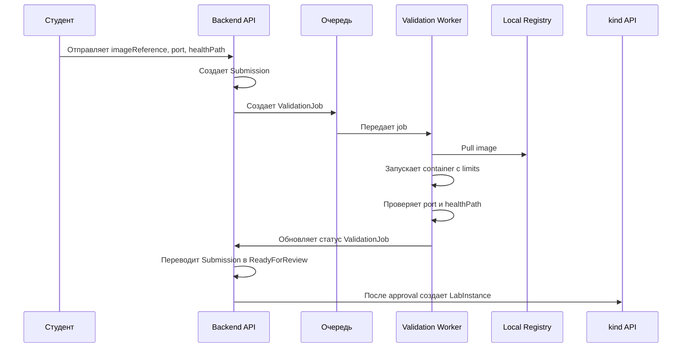
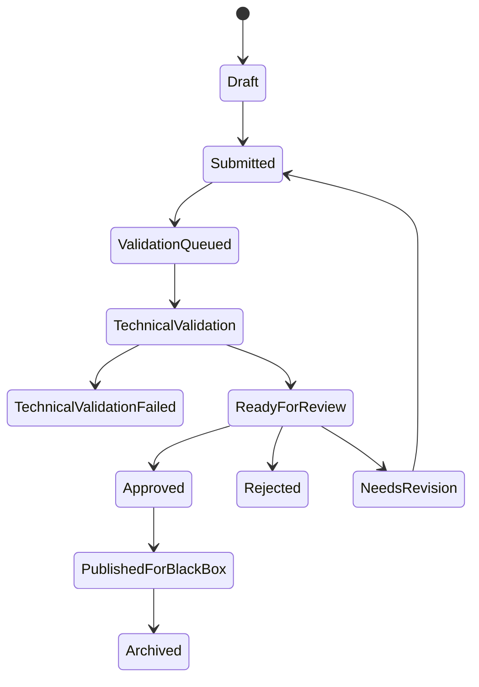
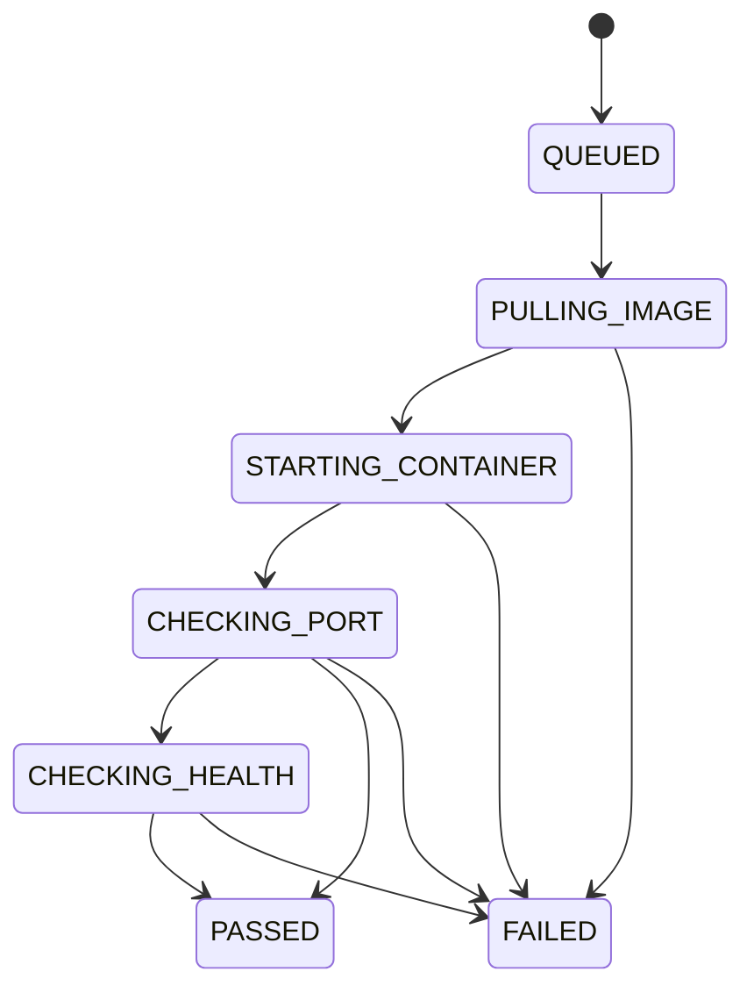

# Архитектура

## Обзор

PEP строится как модульный monorepo с Spring Boot backend, React frontend, worker-сервисом и
локальным Kubernetes runtime через `kind`. Пользовательские Docker images считаются недоверенными
и запускаются только через ограниченные Kubernetes resources.

## Backend-слой

Backend отвечает за бизнес-логику и REST API.

Основные модули:

- identity и RBAC;
- курсы и учебные материалы;
- OWASP Top 10 модули;
- submissions и lifecycle технической проверки;
- отчеты и вложения;
- review и scoring;
- black box assignment distribution;
- lab orchestration facade;
- audit log и notifications.

Долгие операции оформляются как jobs и передаются worker-сервису через очередь.

## Frontend-слой

Frontend реализует русскоязычные сценарии для ролей:

- кабинет студента и просмотр курса;
- страницы Docker-курса;
- страницы OWASP Top 10 модулей;
- форма сдачи Docker image reference;
- редактор white box отчета;
- рабочее место black box тестирования;
- очередь проверок куратора;
- панель администратора для курсов, групп, дедлайнов и lab monitoring.

Рекомендуемые библиотеки:

- React Router для навигации;
- TanStack Query для server state;
- React Hook Form и Zod для форм;
- Markdown editor для отчетов;
- code viewer для примеров уязвимого кода.

## Worker-сервис

В MVP worker не собирает приложения из исходников. Он проверяет готовые Docker images и запускает
утвержденные работы в Kubernetes.

Worker выполняет:

- pull указанного image reference;
- проверку формата image reference;
- запуск контейнера в ограниченной среде;
- проверку startup timeout;
- проверку доступности указанного порта;
- проверку health endpoint, если он указан;
- создание Kubernetes resources для lab instances;
- обновление job status в backend.

Worker не доказывает наличие уязвимости автоматически. Смысловая проверка уязвимости остается за
куратором через white box отчет.

## Хранение данных

PostgreSQL хранит доменное состояние:

- пользователей, роли и группы;
- курсы, модули и уроки;
- OWASP topics;
- submissions и validation jobs;
- lab instances и black box assignments;
- reports, reviews и scores;
- audit events.

Object storage хранит крупные артефакты:

- вложения к отчетам;
- скриншоты и PoC-файлы;
- большие логи технической проверки;
- экспортированные результаты.

## Kubernetes runtime

Для дипломной демонстрации используется локальный Kubernetes через `kind`.

Рекомендуемая модель:

- локальный `kind` cluster;
- local registry для images студентов;
- namespace для платформы;
- namespace для лабораторий;
- Deployment на каждый lab instance;
- Service на каждый lab instance;
- Ingress или port-forward для локального доступа;
- NetworkPolicy для ограничения lateral movement;
- ResourceQuota и LimitRange;
- Pod Security Standards;
- TTL cleanup job.

## API-стиль

Основной API - REST. Для статусов технической проверки и lab runtime можно добавить SSE или
WebSocket после MVP.

Основные API группы:

- `/api/auth`
- `/api/users`
- `/api/groups`
- `/api/courses`
- `/api/modules`
- `/api/lessons`
- `/api/submissions`
- `/api/validation-jobs`
- `/api/labs`
- `/api/black-box-assignments`
- `/api/reports`
- `/api/reviews`
- `/api/admin`
- `/api/audit`

## Поток технической проверки image

## Жизненный цикл submission

## Жизненный цикл validation job

## Среды запуска

- Локально без Kubernetes: Docker Compose для backend, frontend и PostgreSQL.
- Локально с Kubernetes: `kind` cluster, local registry, platform namespace и lab namespace.
- Production: Kubernetes cluster с отдельными namespaces для платформы и lab workloads.

## Архитектурные решения

- Для локального запуска выбран `kind`, потому что он работает поверх Docker и подходит для Windows.
- Основной формат сдачи - Docker image reference.
- Backend не выполняет Docker/Kubernetes операции внутри request handler.
- Проверка image и deploy выполняются асинхронно.
- Backend является источником истины для статусов и прав доступа.
- Worker получает минимальные права и управляет только lab resources.
- Все важные действия администратора и куратора аудируются.
