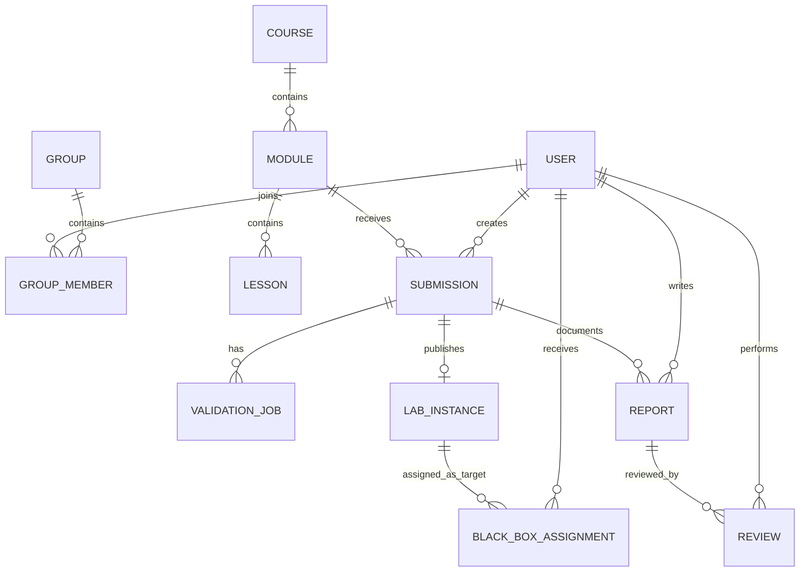
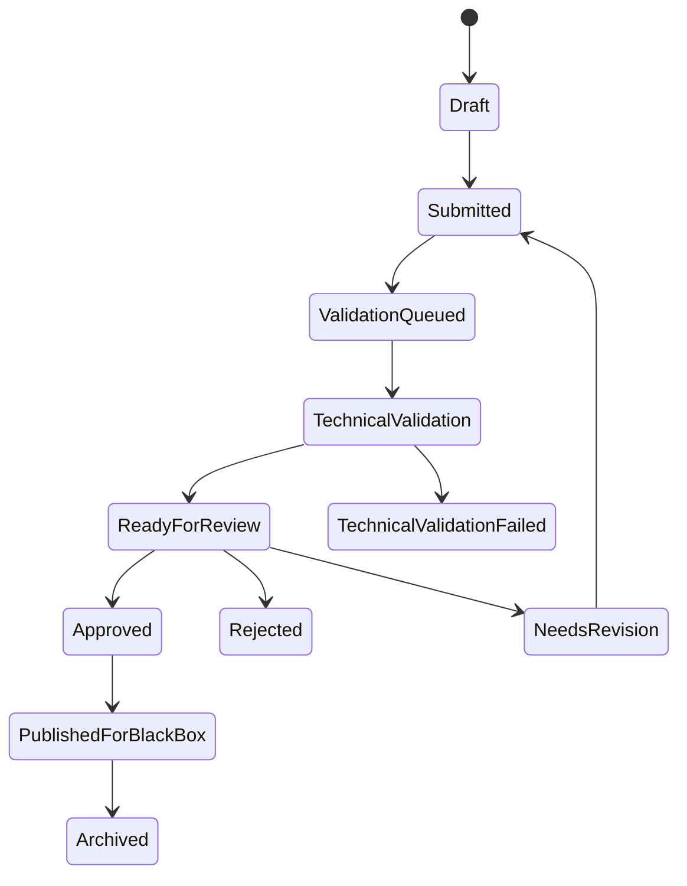
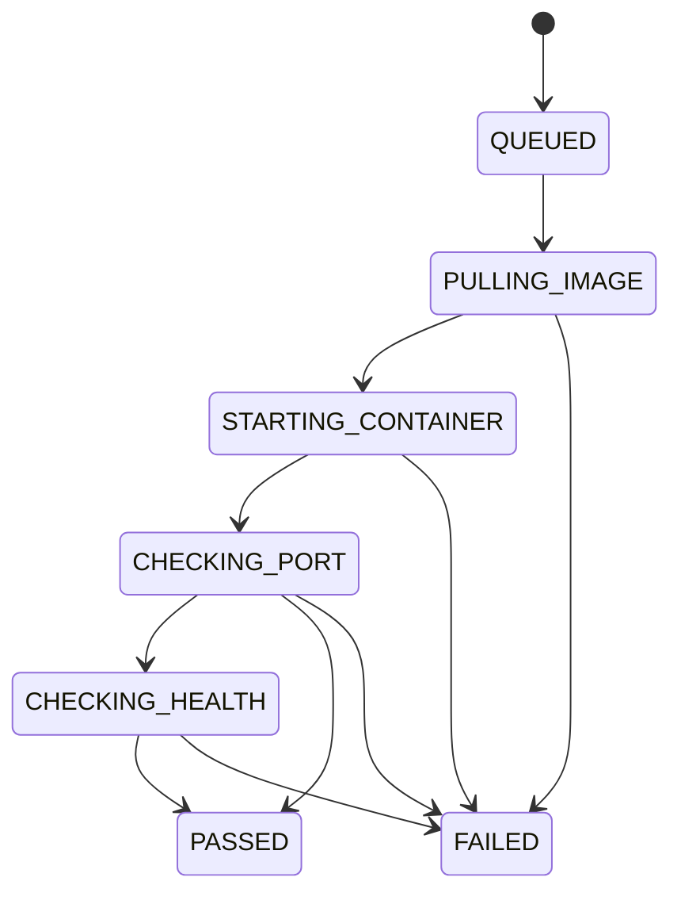
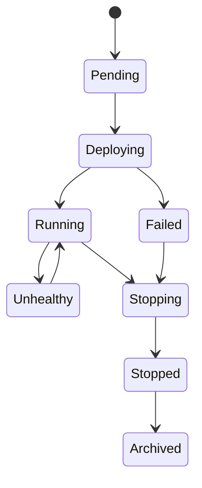
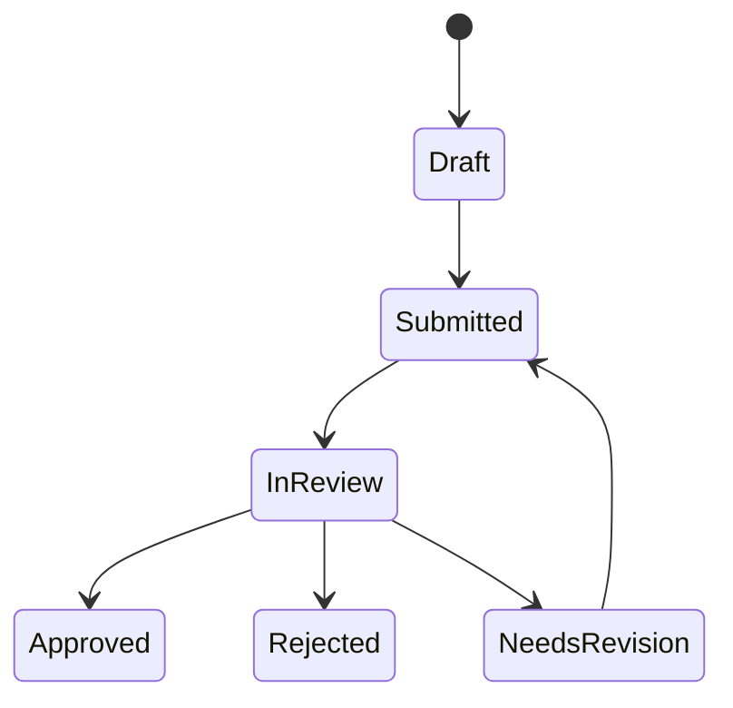

# Доменная модель

## Основные сущности

## Описание сущностей

### User

Аккаунт пользователя платформы.

Поля:

- `id`
- `email`
- `passwordHash`
- `displayName`
- `role`
- `status`
- `createdAt`
- `updatedAt`

### Group

Учебная группа или поток.

Поля:

- `id`
- `name`
- `startsAt`
- `endsAt`
- `status`

### Course

Учебная программа.

Поля:

- `id`
- `title`
- `description`
- `status`
- `createdAt`
- `updatedAt`

### Module

Учебный модуль, обычно рассчитанный примерно на одну неделю.

Поля:

- `id`
- `courseId`
- `title`
- `vulnerabilityTopic`
- `startsAt`
- `submissionDeadline`
- `blackBoxStartsAt`
- `blackBoxDeadline`
- `status`

### Lesson

Страница теоретического или практического материала на русском языке.

Поля:

- `id`
- `moduleId`
- `title`
- `contentMarkdown`
- `orderIndex`
- `lessonType`
- `published`

### Submission

Сдача уязвимого приложения студентом. Основной формат MVP - готовый Docker image reference.

Поля:

- `id`
- `moduleId`
- `studentId`
- `imageReference`
- `applicationPort`
- `healthPath`
- `status`
- `createdAt`
- `submittedAt`
- `approvedAt`

Жизненный цикл:

### ValidationJob

Асинхронная техническая проверка Docker image. В MVP это validation job, а не сборка из исходников.

Поля:

- `id`
- `submissionId`
- `imageReference`
- `status`
- `logsUri`
- `errorMessage`
- `createdAt`
- `startedAt`
- `finishedAt`

Жизненный цикл:

### LabInstance

Запущенный lab в локальном Kubernetes через `kind`.

Поля:

- `id`
- `submissionId`
- `namespace`
- `deploymentName`
- `serviceName`
- `routeUrl`
- `status`
- `expiresAt`
- `createdAt`
- `updatedAt`

Жизненный цикл:

### BlackBoxAssignment

Назначенная студенту цель для black box тестирования.

Поля:

- `id`
- `moduleId`
- `studentId`
- `targetLabInstanceId`
- `status`
- `assignedAt`
- `completedAt`

Правила:

- `studentId` не должен совпадать с владельцем target submission.
- Студент получает три assignments, если достаточно targets.
- Targets распределяются по возможности равномерно.

### Report

White box или black box отчет.

Поля:

- `id`
- `authorId`
- `moduleId`
- `submissionId`
- `blackBoxAssignmentId`
- `type`
- `title`
- `contentMarkdown`
- `status`
- `submittedAt`
- `updatedAt`

Жизненный цикл:

### Review

Проверка, комментарии и оценка куратора.

Поля:

- `id`
- `reportId`
- `curatorId`
- `decision`
- `score`
- `commentMarkdown`
- `createdAt`
- `updatedAt`

## Основные инварианты

- Только approved submissions могут стать black box targets.
- Студент не может тестировать собственный lab.
- Отчеты редактируются автором только в статусах draft или needs revision.
- Решения куратора неизменяемы после финального закрытия модуля, кроме audit admin actions.
- Lab instances должны иметь TTL и resource limits.
- Каждое security-sensitive действие должно создавать audit event.
