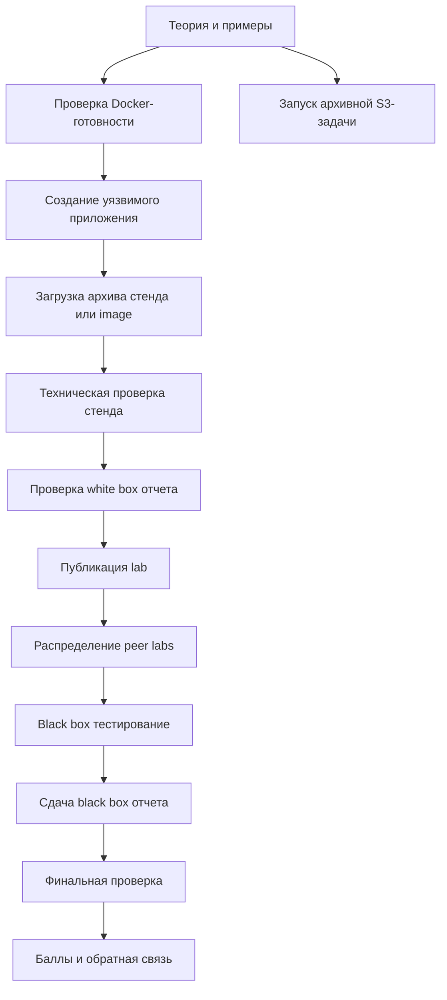

# Учебный цикл

## Недельный цикл модуля

Каждый модуль по уязвимости строится как практический цикл примерно на одну неделю.

## Фаза 1. Теория

Студент получает:

- описание уязвимости на русском языке;
- типовые причины возникновения;
- примеры уязвимого кода;
- примеры исправления;
- сценарии эксплуатации;
- объяснение impact;
- границы допустимого тестирования.

Темы строятся по программе Академии web-безопасности: SQL-инъекции, XSS, SSTI, SSRF, CSRF, CORS,
XXE, бизнес-логика, BAC и IDOR.

## Фаза 2. Docker readiness

Студент должен пройти вводный Docker-курс до сдачи практического приложения.

Критерии допуска:

- архив стенда содержит `Dockerfile` или `docker-compose.yml`;
- image собирается локально или опубликован в registry;
- image reference корректен для fallback-сценария;
- приложение стартует без ручного ввода;
- port документирован;
- опасные Docker-настройки не требуются.

## Фаза 3. White box build

Студент создает уязвимое приложение по теме модуля.

Обязательные результаты:

- архив стенда или Docker image reference;
- port приложения;
- опциональный health endpoint;
- краткий README;
- white box отчет;
- payload или сценарий эксплуатации;
- рекомендация по исправлению.

## Фаза 4. Техническая проверка

Платформа проверяет image до передачи работы куратору.

Проверки:

- image reference доступен;
- image можно скачать;
- container стартует за заданный timeout;
- указанный port отвечает;
- health endpoint отвечает, если указан;
- image size не превышает лимит;
- privileged mode не требуется;
- host networking не требуется;
- container можно запустить с CPU/RAM limits.

Автоматическая проверка не доказывает наличие уязвимости. Она подтверждает только техническую
готовность image к запуску.

## Фаза 5. Проверка white box отчета

Куратор проверяет:

- соответствует ли уязвимость теме модуля;
- воспроизводится ли эксплуатация;
- объяснена ли причина уязвимости;
- указано ли место уязвимого кода;
- реалистично ли описан impact;
- корректно ли предложено исправление.

Решения:

- принято;
- отклонено;
- нужна доработка.

## Фаза 6. Публикация lab

Утвержденные submissions запускаются как lab instances в локальном `kind`-кластере.

Платформа:

- создает или переиспользует namespace модуля;
- deploy указанного image;
- создает service и route;
- применяет network и resource policies;
- скрывает автора от назначенных тестировщиков;
- сохраняет runtime URL и status.

## Фаза 7. Распределение задач студентов

Куратор или администратор запускает распределение после появления достаточного числа утвержденных
работ. Одобрение стенда куратором означает только готовность к распределению; студент получает
доступ строго после создания assignment.

Правила:

- каждый студент получает до трех чужих lab;
- студент не получает собственную работу;
- цели распределяются по возможности равномерно;
- результат фиксируется после старта фазы;
- ручные изменения аудируются.

## Фаза 8. Black box тестирование

Студент тестирует назначенные приложения без доступа к исходному коду.

Разрешено:

- браузер;
- HTTP proxy;
- ручные payloads;
- базовые scanners, если это разрешено правилами модуля;
- заметки и скриншоты.

Запрещено:

- атаковать инфраструктуру платформы;
- пытаться выполнить container escape;
- проводить denial of service;
- открывать приложения, которые не назначены студенту;
- атаковать пользователей вне scope.

## Фаза 9. Black box отчет

Обязательные разделы:

- идентификатор цели;
- краткое описание уязвимости;
- severity и impact;
- шаги воспроизведения;
- payloads;
- доказательства;
- рекомендации по исправлению;
- ограничения тестирования.

## Фаза 10. Финальная проверка

Куратор оценивает:

- валидность находок;
- воспроизводимость;
- техническую ясность;
- обоснование severity;
- качество рекомендаций;
- оформление отчета.

Студент получает:

- балл;
- комментарии;
- принятые находки;
- отклоненные находки с объяснением;
- рекомендации по дальнейшему обучению.

## Критерии завершения модуля

Студент завершает модуль, когда:

- Docker prerequisite пройден;
- white box submission принят;
- обязательные black box отчеты отправлены;
- проверка куратора завершена;
- итоговый балл рассчитан.
