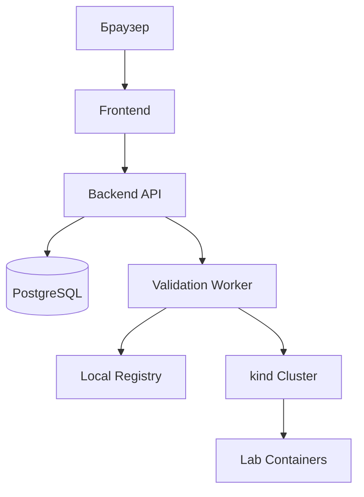

# Локальный запуск через kind

## Цель

Дипломная демонстрация должна запускаться локально на компьютере без облачного Kubernetes.
Для этого используется `kind` - Kubernetes-кластер внутри Docker containers.

## Требования к машине

- Windows 10/11.
- Docker Desktop или Docker Engine.
- `kubectl`.
- `kind`.
- Node.js для frontend разработки.
- Java 17+ и Maven для backend разработки.

## Локальная схема



## Компоненты

- `compose.yaml` - быстрый запуск backend, frontend и PostgreSQL без Kubernetes.
- `kind` cluster - локальный Kubernetes для демонстрации lab runtime.
- Local registry - место, куда студент публикует Docker image для проверки.
- `deploy/k8s/platform.yaml` - манифесты платформы.
- `deploy/k8s/lab-security-baseline.yaml` - namespace, quotas, limits и network policies.
- `deploy/k8s/lab-template.yaml` - пример lab deployment.

## Рекомендуемый сценарий запуска

1. Установить Docker Desktop.
2. Установить `kubectl`.
3. Установить `kind`.
4. Создать локальный `kind` cluster.
5. Поднять local registry.
6. Собрать backend и frontend images.
7. Загрузить images в `kind`.
8. Применить Kubernetes manifests.
9. Опубликовать тестовый vulnerable app image.
10. Запустить техническую проверку image.
11. Опубликовать lab instance.
12. Открыть lab через ingress или port-forward.

## Создание kind cluster

```powershell
kind create cluster --config deploy/kind/cluster.yaml
kubectl cluster-info --context kind-pep-local
kubectl get nodes
```

## Local registry

Для дипломной демонстрации удобно использовать registry на `localhost:5001`. Студентский image
публикуется туда, а `kind` получает доступ к этому registry изнутри cluster network.

Запуск registry:

```powershell
docker run -d --restart=always -p 5001:5000 --name pep-local-registry registry:2
```

Подключение registry к Docker network, которую использует `kind`:

```powershell
docker network connect kind pep-local-registry
```

Проверка:

```powershell
docker ps --filter name=pep-local-registry
```

## Публикация student image

Пример для уязвимого приложения:

```powershell
docker build -t vulnerable-sqli-demo:latest ./examples/vulnerable-sqli-demo
docker tag vulnerable-sqli-demo:latest localhost:5001/vulnerable-sqli-demo:latest
docker push localhost:5001/vulnerable-sqli-demo:latest
```

Image reference для сдачи на платформе:

```text
localhost:5001/vulnerable-sqli-demo:latest
```

Если image должен скачиваться изнутри `kind`, в Kubernetes manifests обычно используется internal
registry name:

```text
pep-local-registry:5000/vulnerable-sqli-demo:latest
```

Backend может хранить исходный user-facing reference и internal runtime reference отдельно.

## Применение Kubernetes manifests

```powershell
kubectl apply -f deploy/k8s/lab-security-baseline.yaml
kubectl apply -f deploy/k8s/lab-template.yaml
```

Проверка lab namespace:

```powershell
kubectl get ns
kubectl get resourcequota -n pep-labs-example
kubectl get networkpolicy -n pep-labs-example
```

## Доступ к lab

Для MVP достаточно port-forward:

```powershell
kubectl port-forward -n pep-labs-example service/sample-student-lab 18080:8080
```

После этого lab открывается по адресу:

```text
http://localhost:18080
```

Ingress можно добавить после того, как базовый сценарий port-forward стабильно работает.

## Troubleshooting для Windows

- Если `kind create cluster` не видит Docker, нужно запустить Docker Desktop и дождаться состояния
  `Docker Desktop is running`.
- Если `kubectl` смотрит не в тот cluster, проверьте контекст командой `kubectl config current-context`.
- Если registry container уже существует, удалите его командой `docker rm -f pep-local-registry` и
  запустите заново.
- Если push в `localhost:5001` не работает, проверьте, что port `5001` не занят другим процессом.
- Если pod в `kind` не может скачать image, проверьте подключение registry к network `kind`.
- Если NetworkPolicy не работает локально, это может быть ограничением CNI. Для защиты диплома
  достаточно показать манифесты политик и объяснить, что production-кластер должен использовать CNI
  с поддержкой NetworkPolicy.

## Почему выбран kind

- Работает локально и не требует облака.
- Хорошо подходит для дипломной демонстрации.
- Позволяет показать реальные Kubernetes objects.
- Интегрируется с Docker.
- Проще контролировать и удалять после демонстрации.

## Ограничения локального режима

- Ресурсы ограничены мощностью компьютера.
- Ingress может потребовать дополнительной настройки.
- NetworkPolicy зависит от CNI, поэтому для полноценной демонстрации сетевых ограничений может
  понадобиться kind cluster с подходящим CNI.
- Production-настройки registry, TLS, backup и мониторинга в локальном режиме упрощаются.

## Что важно показать на защите

- Платформа запускается локально.
- Docker image студента проходит техническую проверку.
- Lab container поднимается в Kubernetes.
- У lab container есть CPU/RAM limits.
- Namespace имеет baseline security policies.
- Студент получает URL или port-forward для black box тестирования.
