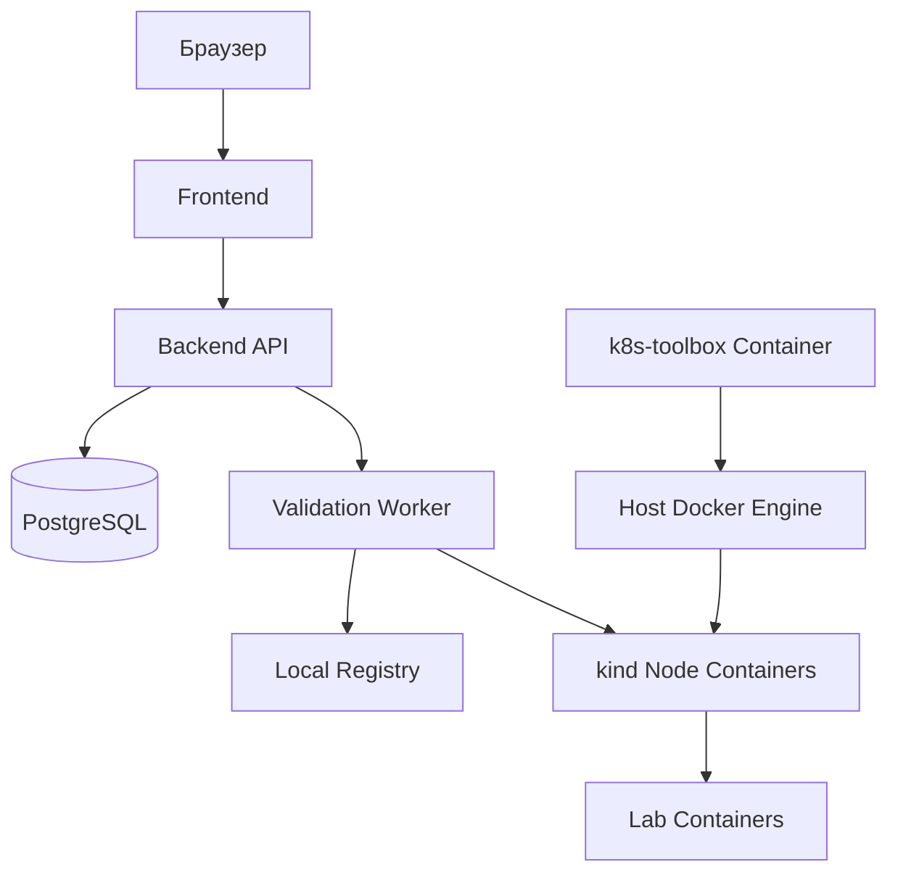

# Containerized запуск через kind

## Цель

Дипломная демонстрация должна запускаться локально без облачного Kubernetes и без установки
`kind`/`kubectl` на хост. Для этого используется `kind` - Kubernetes-кластер внутри Docker
containers, а управление выполняется из `k8s-toolbox` container.

## Требования к машине

- Windows 10/11.
- Docker Desktop или Docker Engine.
- Docker Compose plugin.

Для запуска demo-контура не требуется устанавливать `kind`, `kubectl`, Java, Maven или Node.js на
host: эти инструменты запускаются через containers.

## Локальная схема



## Компоненты

- `compose.yaml` - быстрый запуск backend, frontend и PostgreSQL без Kubernetes.
- `k8s-toolbox` - container с Docker CLI, `kind` и `kubectl`.
- `kind` cluster - Kubernetes-ноды как Docker containers для демонстрации lab runtime.
- `registry` - container с local registry, куда студент публикует Docker image для проверки.
- `deploy/k8s/platform.yaml` - манифесты платформы.
- `deploy/k8s/lab-security-baseline.yaml` - namespace, quotas, limits и network policies.
- `deploy/k8s/lab-template.yaml` - пример lab deployment.

## Рекомендуемый сценарий запуска

1. Установить Docker Desktop.
2. Запустить `registry` и `k8s-toolbox` через Docker Compose.
3. Создать `kind` cluster из toolbox container.
4. Опубликовать тестовый vulnerable app image в local registry.
5. Применить Kubernetes manifests из toolbox container.
6. Запустить техническую проверку image.
7. Опубликовать lab instance.
8. Открыть lab через port-forward из toolbox container.

## Запуск toolbox и registry

```powershell
docker compose up -d registry k8s-toolbox
```

Проверка:

```powershell
docker compose ps registry k8s-toolbox
docker compose exec k8s-toolbox kind version
docker compose exec k8s-toolbox kubectl version --client
```

## Создание kind cluster

```powershell
docker compose exec k8s-toolbox pep-kind-create
```

`pep-kind-create` создает cluster, подключает `k8s-toolbox` и `pep-local-registry` к Docker network
`kind`, затем сохраняет internal kubeconfig в volume `pep-kubeconfig`.

## Local registry

Для дипломной демонстрации registry запускается как Compose service `registry` на `localhost:5001`.
Студентский image публикуется туда, а `kind` получает доступ к registry через container name
`pep-local-registry:5000`.

Проверка:

```powershell
docker compose ps registry
```

## Публикация student image

Пример для уязвимого приложения:

```powershell
docker compose exec k8s-toolbox docker build -t vulnerable-sqli-demo:latest ./examples/vulnerable-sqli-demo
docker compose exec k8s-toolbox docker tag vulnerable-sqli-demo:latest localhost:5001/vulnerable-sqli-demo:latest
docker compose exec k8s-toolbox docker push localhost:5001/vulnerable-sqli-demo:latest
```

Image reference для сдачи на платформе:

```text
localhost:5001/vulnerable-sqli-demo:latest
```

Если image должен скачиваться изнутри `kind`, в Kubernetes manifests обычно используется internal
registry name:

```text
pep-local-registry:5000/vulnerable-sqli-demo:latest
```

Backend может хранить исходный user-facing reference и internal runtime reference отдельно.

## Запуск lab instance

```powershell
docker compose exec k8s-toolbox pep-lab-deploy <submissionId> localhost:5001/vulnerable-sqli-demo:latest 8080
```

`pep-lab-deploy` создает isolated namespace, quota, limits, deployment и service для конкретной
submission. Для images из local registry script автоматически заменяет user-facing reference
`localhost:5001/...` на internal reference `pep-local-registry:5000/...`, доступный из `kind`.

Проверка lab namespace:

```powershell
docker compose exec k8s-toolbox kubectl get ns
docker compose exec k8s-toolbox kubectl get resourcequota -n pep-lab-<submissionId-prefix>
docker compose exec k8s-toolbox kubectl get pods,svc -n pep-lab-<submissionId-prefix>
```

## Доступ к lab

Для MVP достаточно port-forward:

```powershell
docker compose exec k8s-toolbox pep-lab-forward <submissionId> 8080 18080
```

После этого lab открывается по адресу:

```text
http://localhost:18080
```

Ingress можно добавить после того, как базовый сценарий port-forward стабильно работает.

## Troubleshooting для Windows

- Если toolbox не видит Docker, проверьте mount `/var/run/docker.sock` в `compose.yaml` и состояние
  Docker Desktop.
- Если `kubectl` не подключается к cluster, повторите `docker compose exec k8s-toolbox pep-kind-create`.
- Если registry container уже существует вне Compose, удалите его или переименуйте, чтобы не
  конфликтовать с `pep-local-registry`.
- Если push в `localhost:5001` не работает, проверьте, что port `5001` не занят другим процессом.
- Если pod в `kind` не может скачать image, проверьте подключение registry к network `kind`.
- Если NetworkPolicy не работает локально, это может быть ограничением CNI. Для защиты диплома
  достаточно показать манифесты политик и объяснить, что production-кластер должен использовать CNI
  с поддержкой NetworkPolicy.

## Почему выбран kind

- Работает локально и не требует облака.
- Kubernetes-ноды, registry и tooling запускаются как containers.
- Хорошо подходит для дипломной демонстрации.
- Позволяет показать реальные Kubernetes objects.
- Интегрируется с Docker.
- Проще контролировать и удалять после демонстрации.

## Ограничения локального режима

- Ресурсы ограничены мощностью компьютера.
- Ingress может потребовать дополнительной настройки.
- NetworkPolicy зависит от CNI, поэтому для полноценной демонстрации сетевых ограничений может
  понадобиться kind cluster с подходящим CNI.
- Production-настройки registry, TLS, backup и мониторинга в локальном режиме упрощаются.
- Toolbox использует Docker socket host-машины, поэтому подходит для локальной демонстрации, но не
  является production security pattern.

## Что важно показать на защите

- Платформа запускается локально.
- Docker image студента проходит техническую проверку.
- Lab container поднимается в Kubernetes.
- У lab container есть CPU/RAM limits.
- Namespace имеет baseline security policies.
- Студент получает URL или port-forward для black box тестирования.
